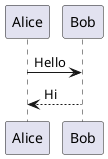

# PlantUML Render

## 项目介绍
PlantUML Render 是一个基于 WPF 的应用程序，用于渲染 PlantUML 代码并显示生成的图片。它支持鼠标滚轮缩放、拖动和双击还原功能，使用户可以更方便地查看图片的细节。

## 功能
- 渲染 PlantUML 代码为 PNG 图片
- 支持鼠标滚轮缩放
- 支持鼠标拖动图片
- 支持双击还原图片
- 支持保存生成的图片

## 使用方法
### 安装
1. 克隆或下载本项目
2. 使用 Visual Studio 打开解决方案文件
3. 确保安装了 .NET Framework 4.8 或更高版本
4. 安装所需的 NuGet 包（如 PlantUml.Net）

### 运行
1. 在 Visual Studio 中按 F5 运行项目
2. 在左侧文本框中输入 PlantUML 代码
3. 点击 "Render" 按钮生成图片
4. 使用鼠标滚轮缩放图片，拖动图片查看细节
5. 双击图片还原到初始大小
6. 点击 "Save" 按钮保存图片

## 配置
### PlantUML 服务器
默认情况下，项目使用在线 PlantUML 服务器。如果需要使用本地服务器，请修改 `RendererFactory` 的配置。

```csharp
var renderer = new RendererFactory().CreateRenderer(
    new RendererSettings
    {
        ServerUrl = "http://localhost:8080"
    }
);
```

## 示例
### 输入 PlantUML 代码


### 生成的图片
由于网络原因，无法直接访问图片资源。请确保网络连接正常，或者使用本地图片查看器查看生成的图片。

## 常见问题
### 1. 图片无法生成
- 确保 PlantUML 代码格式正确
- 检查网络连接是否正常
- 确保 PlantUML 服务器地址正确

### 2. 图片无法缩放或拖动
- 确保使用的是最新版本的 WPF
- 确保鼠标事件已正确绑定

### 3. 图片保存失败
- 确保有写入权限
- 确保文件路径有效


## 许可证
本项目使用 MIT 许可证。请参阅 [LICENSE](LICENSE) 文件获取更多信息。

## 致谢
感谢 [PlantUml.Net](https://github.com/plantuml/PlantUml.Net) 项目提供的渲染功能。
